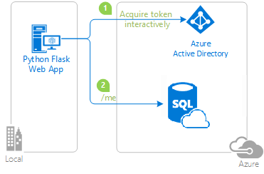

## Python web application using AAD passthrough to authenticate against Azure SQL

## About this sample

This sample is derivated from https://github.com/Azure-Samples/ms-identity-python-webapp, in which user data is retrieved from Microsoft Graph.

### Overview

This sample demonstrates a Python web application that signs-in users with the Microsoft identity platform and calls an Azure SQL Database.

1. The python web application uses the Microsoft Authentication Library (MSAL) to obtain a JWT access token from the Microsoft identity platform (formerly Azure AD v2.0):
2. The access token is used as a bearer token to authenticate the user when calling the Azure SQL Database.



### Scenario

This sample shows how to build a Python web app using Flask and MSAL Python,
that signs in a user, and get access to Azure SQL Database.
For more information about how the protocols work in this scenario and other scenarios,
see [Authentication Scenarios for Azure AD](https://docs.microsoft.com/en-us/azure/active-directory/develop/active-directory-authentication-scenarios).

## How to run this sample

To run this sample, you'll need:

> - [Python 2.7+](https://www.python.org/downloads/release/python-2713/) or [Python 3+](https://www.python.org/downloads/release/python-364/)
> - An Azure Active Directory (Azure AD) tenant. For more information on how to get an Azure AD tenant, see [how to get an Azure AD tenant.](https://docs.microsoft.com/azure/active-directory/develop/quickstart-create-new-tenant)


### Step 1:  Clone or download this repository

From your shell or command line:

```Shell
git clone https://github.com/rebremer/ms-identity-python-webapp-sqldb.git
```

or download and extract the repository .zip file.

> Given that the name of the sample is quite long, you might want to clone it in a folder close to the root of your hard drive, to avoid file name length limitations when running on Windows.

### Step 2:  Register the sample application with your Azure Active Directory tenant

Create and configure an app registration as follows:

- Create an app registration using the steps in this [link](https://docs.microsoft.com/en-us/azure/azure-sql/database/active-directory-interactive-connect-azure-sql-db#register-your-app-and-set-permissions) to create an app registration. Key is to add permissions for Azure SQL database as delegated user
- Important: Admin consent is required for Azure SQL Database. This can be either done by selecting **Grant_admin consent for Default Directory** in the **permissions** tab or at runtime while logging in
- Use `http://localhost:5000/getAToken` as reply URL. In case you did not do this during creation, it can be added using the **Authentication** tab of the app registration
- Go to **Certificates & Secrets** to create a secret. Copy the client_id and client secret

### Step 3:  Create an Azure SQL DB

- Create an Azure SQL DB using this [link](https://docs.microsoft.com/en-us/azure/azure-sql/database/single-database-create-quickstart?tabs=azure-portal#create-a-single-database)
- Once the database is created, add Azure AD users and give a reader role using the following two statements:
  - `CREATE USER [<<AAD user email address>>] FROM EXTERNAL PROVIDER; `                      
  - `EXEC sp_addrolemember [db_datareader], [<<AAD user email address>>]; `

### Step 4:  Configure the sample to use your Azure AD tenant

In the steps below, "ClientID" is the same as "Application ID" or "AppId".

#### Configure the pythonwebapp project

> Note: if you used the setup scripts, the changes below may have been applied for you

1. Open the `app_config.py` file
2. Find the app key `<<Enter_the_Tenant_Name_Here>>` and replace the existing value with your Azure AD tenant name.
3. You saved your application secret during the creation of the `python-webapp` app in the Azure portal.
   Now you can set the secret in environment variable `<<CLIENT_SECRET>>`,
   and then adjust `app_config.py` to pick it up.
4. Find the app key `<<Enter_the_Application_Id_here>>` and replace the existing value with the application ID (clientId) of the `python-webapp` application copied from the Azure portal.
5. Find the app key `<<Enter_the_Application_Id_here>>` and replace the existing value with the application ID (clientId) of the `python-webapp` application copied from the Azure portal.
6. Find the app key `<<Enter_logical_SQL_server_URL_here>>` and replace the existing value with the SQL server name created in step 4. Subsequently, change the app key `<<Enter_SQL_database_name_here>>` with the database name.

### Step 5: Run the sample

- You will need to install dependencies using pip as follows:
```Shell
$ pip install -r requirements.txt
```

Run app.py from shell or command line. Note that the port needs to match what you've set up in your redirect_uri:
```Shell
$ flask run --port 5000
```

## More information

For more information, see the original [github project](https://github.com/Azure-Samples/ms-identity-python-webapp). Or leave a message in this github project.