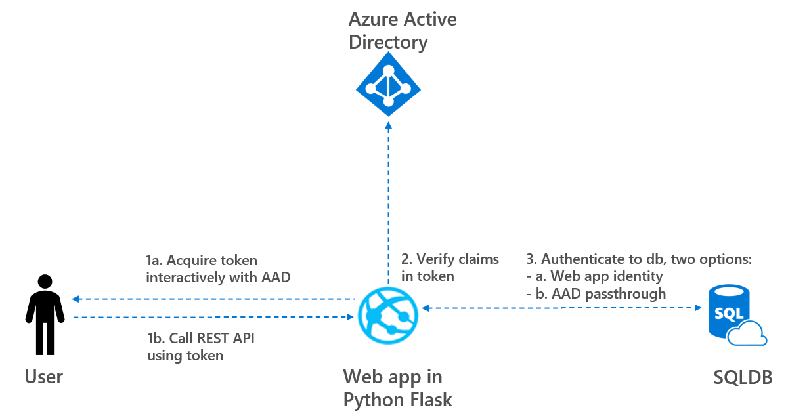

## Python web application using Azure AD to authenticate against Azure SQL

### Overview

This sample demonstrates a Python web application that signs-in users with the Microsoft identity platform and retrieves data from an Azure SQL Database. Use case is described as follows.

- 1a: User logs in and the python web application and obtains a JWT access token from Azure AD
- 1b: User call a REST API to fetch data using token 
- 2: Web app matches the claims in the token with required roles to verify if user is allowed to retrieve data
- 3: Web app authenticate to the database. Two scenarios are supported in this web app as follows:
  - Scenario a. AAD Application Identity: The Identity of the application is used to create bearer token and to authenticate to the database
  - Scenario b. AAD User Passthrough: The access token is used as a bearer token to authenticate the user when calling the Azure SQL Database.

See also architecture below.



In the remaining of this blog, the following steps are executed:
- Step 1: Acquire token and call api using token
- Step 2: Verify claims in token
- Step 3a: AAD Application Identity authentication
- Step 3b: AAD User passthrough authentication

This sample is derived from https://github.com/Azure-Samples/ms-identity-python-webapp, in which user data is retrieved from Microsoft Graph.

### Step 1: Acquire token and call api using token

This sample shows how to build a Python web app using Flask and MSAL Python,
that signs in a user, and get access to Azure SQL Database. For more information about how the protocols work in this scenario and other scenarios, see [Authentication Scenarios for Azure AD](https://docs.microsoft.com/en-us/azure/active-directory/develop/active-directory-authentication-scenarios). In this step, the following sub steps are executed

- 1.1: Preliminaries
- 1.2: Create and configure app registration
- 1.3: Create and configure Azure SQL database
- 1.4: Configure the pythonwebapp project
- 1.5: Run the sample

#### 1.1: Preliminaries

To run this sample, you'll need:

- [Python 2.7+](https://www.python.org/downloads/release/python-2713/) or [Python 3+](https://www.python.org/downloads/release/python-364/)
- An Azure Active Directory (Azure AD) tenant. For more information on how to get an Azure AD tenant, see [how to get an Azure AD tenant.](https://docs.microsoft.com/azure/active-directory/develop/quickstart-create-new-tenant)
- Git to clone the following project: git clone https://github.com/rebremer/ms-identity-python-webapp-sqldb.git or download and extract the repository .zip file.

#### 1.2: Create and configure app registration

Create and configure an app registration as follows:

- Create an app registration using the steps in this [link](https://docs.microsoft.com/en-us/azure/active-directory/develop/quickstart-register-app) to create an app registration. Two remarks:
  - Use `http://localhost:5000/getAToken` as reply URL. In case you did not do this during creation, it can be added using the **Authentication** tab of the app registration
  - Go to **Certificates & Secrets** to create a secret. Copy the client_id and client secret

#### 1.3: Create an Azure SQL DB

- Create an Azure SQL DB using this [link](https://docs.microsoft.com/en-us/azure/azure-sql/database/single-database-create-quickstart?tabs=azure-portal#create-a-single-database)

#### 1.4: Configure the pythonwebapp project

1. Open the `app_config.py` file
2. Find the app key `<<Enter_the_Tenant_Name_Here>>` and replace the existing value with your Azure AD tenant name.
3. You saved your application secret during the creation of the `python-webapp` app in the Azure portal.
   Now you can set the secret in environment variable `<<CLIENT_SECRET>>`,
   and then adjust `app_config.py` to pick it up.
4. Find the app key `<<Enter_the_Application_Id_here>>` and replace the existing value with the application ID (clientId) of the `python-webapp` application copied from the Azure portal.
5. Find the app key `<<Enter_logical_SQL_server_URL_here>>` and replace the existing value with the SQL server name created in step 3. Subsequently, change the app key `<<Enter_SQL_database_name_here>>` with the database name.

#### Step 1.5: Run the sample

- You will need to install dependencies using pip as follows:
```Shell
$ pip install -r requirements.txt
```

Run app.py from shell or command line. Note that the port needs to match what you've set up in your redirect_uri:
```Shell
$ flask run --port 5000
```

When the app is run locally, it can be visited by localhost:5000 (not 127.0.0.1:5000). In the next step, the user roles are set that can be used to verify if user is allowed to retrieve data using the API

### Step 2: Verify claims in token

In this step, the claims in the tokens can be set. The following sub steps are executed:

- 2.1: Set configuration in app config
- 2.2: Add roles to manifest
- 2.3: Assign user to role

#### 2.1: Set configuration in app config

Claim verification is an optional step and can be disabled using the following setting
in `app_config.py` file

```Python
AAD_ROLE_CHECK = False
```

#### 2.2: Add roles to manifest

Follow the steps in [this](https://docs.microsoft.com/en-us/azure/active-directory/develop/howto-add-app-roles-in-azure-ad-apps) tutorial to add roles to app registration created in step 1.1. As manifest, the following appRles shall be used:

```json
	"appRoles": [
		{
			"allowedMemberTypes": [
				"User"
			],
			"description": "Read customer role can read Customer data from SQLDB",
			"displayName": "read_customer",
			"id": "a8161423-2e8e-46c4-9997-f984faccb625",
			"isEnabled": true,
			"value": "read_customer"
		},
		{
			"allowedMemberTypes": [
				"User"
			],
			"description": "Read product can read Product data from SQLDB",
			"displayName": "read_product",
			"id": "72ff9f53-8011-49e0-a4f4-cc1bb26206fa",
			"isEnabled": true,
			"value": "read_product"
		}
	],
```

#### 2.3: Assign user to role

The assignment of users is explained in [this](https://docs.microsoft.com/en-us/azure/active-directory/develop/howto-add-app-roles-in-azure-ad-apps#assign-users-and-groups-to-roles). As a test, two users can be created. User 1 is assigned the `read_customer`, whereas user 2 gets the `read_product` role. 

In the next step, the application identity is used to retrieve data form the database.

### Step 3a: AAD Application Identity authentication

In this step, the Application Identity of the app registration is used to retrieve data. The following sub steps are executed:

- 3a.1: Set configuration in app config
- 3a.2: Add app registration as user to database

#### 3a.1: Set configuration in app config

 AAD Application Identity authentication can be set in the `app_config.py` file as follows

```Python
# In case DATABASE_AUTHENTICATION = "AAD_USER_PASSTHROUGH", the user bearer token is used to authenticate to the database.
# SCOPE https://database.windows.net//.default is required, see below. Caution: this scope likely requirems admin consent
#DATABASE_AUTHENTICATION = "AAD_USER_PASSTHROUGH"
#SCOPE = ["https://database.windows.net//.default"]
#
# Option 1b. AAD_APPLICATION_MI
#
# In case DATABASE_AUTHENTICATION = "AAD_APPLICATION_MI", the MI of the application is used to create bearer token and to authenticate to the database.
# SCOPE can be empty, no admin consent requirement
DATABASE_AUTHENTICATION = "AAD_APPLICATION_MI"
SCOPE = []
```

#### 3a.2: Set configuration in app config

- Add Azure AD users and give a reader role using the following two statements:
  - `CREATE USER [<<Name of app registration>>] FROM EXTERNAL PROVIDER; `                      
  - `EXEC sp_addrolemember [db_datareader], [<<Name of app registration>>]; `

Now the app can be run as described in step 1.5. When you click on the link `Get Customer data from Database` , customer data is retrieved. Subsequently, when there is clicked on the link `Get PRoduct data from Database`, product data is retrieved (provided that claims are set correctly for user in step 2 or check is disabled)

In this step, the identity of the app is used to retrieve data. However, the identity of the user can also passed (AAD passthrough) to retrieve data from the database. 

### Step 3b: AAD User passthrough authentication

In the step, the Identity of the user itself is used to retrieve data. The following sub steps are executed:

- 3b.1: Set configuration in app config
- 3b.2: Add Azure SQL DB Scope to app registration
- 3b.3: Add AAD user to database

#### 3b.1: Set configuration in app config

 AAD Application Identity authentication can be set in the `app_config.py` file as follows

```Python
# In case DATABASE_AUTHENTICATION = "AAD_USER_PASSTHROUGH", the user bearer token is used to authenticate to the database.
# SCOPE https://database.windows.net//.default is required, see below. Caution: this scope likely requirems admin consent
DATABASE_AUTHENTICATION = "AAD_USER_PASSTHROUGH"
SCOPE = ["https://database.windows.net//.default"]
#
# Option 1b. AAD_APPLICATION_MI
#
# In case DATABASE_AUTHENTICATION = "AAD_APPLICATION_MI", the MI of the application is used to create bearer token and to authenticate to the database.
# SCOPE can be empty, no admin consent requirement
#DATABASE_AUTHENTICATION = "AAD_APPLICATION_MI"
#SCOPE = []
```

#### 3b.2: Add Azure SQL DB Scope to app registration

- Modify your app registration created in step 1.2. with permissions for Azure SQL database as delegated user. This is explained in this [link](https://docs.microsoft.com/en-us/azure/azure-sql/database/active-directory-interactive-connect-azure-sql-db#register-your-app-and-set-permissions) 
- Important: Admin consent is required for Azure SQL Database. This can be either done by selecting **Grant_admin consent for Default Directory** in the **permissions** tab or at runtime while logging in

#### 3b.3: Add AAD user to database

- Since AAD passtrhough is used in this step, the users themselves shall have the appropriate roles in the SQLDB as external user and datareader. See example how to do this below.
  - `CREATE USER [<<AAD user email address>>] FROM EXTERNAL PROVIDER; `                      
  - `EXEC sp_addrolemember [db_datareader], [<<AAD user email address>>]; `
    -  (in case you want to be more granular in rolemembers in the database, `read_customer` reads data from SalesLT.Customer, whereas `read_product` reads data from SalesLT.Product)


Now the app can be run as described in step 1.5, in which data can be retrieved from the database using the identity of the logged in user.

## Conclusion

In this github project, a Python web application is created that retrieves data from SQLDB. Users claims, AAD Managed Identites and/or AAD passthrough can be used to authenticate and authorize users to retrieve data, see also overview below.


## More information

For more information, see the original [github project](https://github.com/Azure-Samples/ms-identity-python-webapp). Or leave a message in this github project.